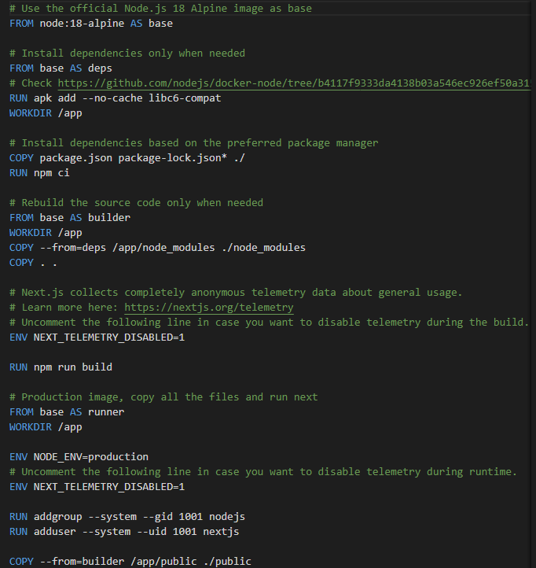
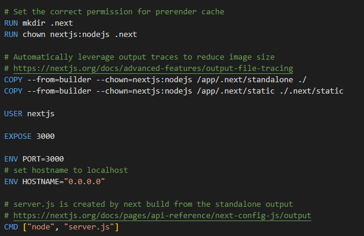
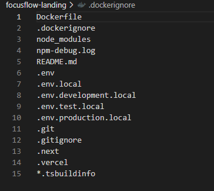
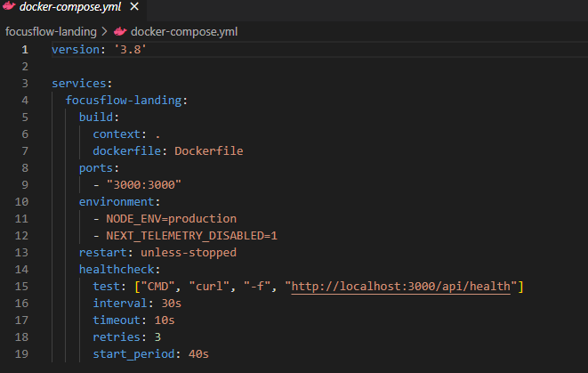
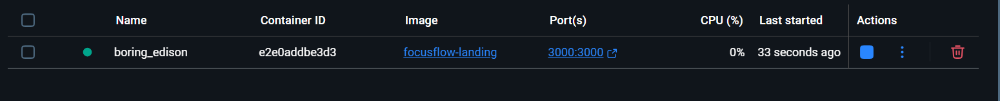

# Dock## 📦 What's in the Dockerfile?
This project uses a **multi-stage Docker build** for the Next.js application with the following stages:

**Stage 1 - Base:** Uses Node.js 18 Alpine as the foundation
**Stage 2 - Dependencies:** Installs npm dependencies with libc6-compat for Alpine compatibility
**Stage 3 - Builder:** Builds the Next.js application with telemetry disabled
**Stage 4 - Runner:** Creates the production image with:
- Node.js production environment
- Non-root user (nextjs) for security
- Standalone output for optimized performance
- Exposes port 3000
- Runs the built application with `node server.js`

**My actual Dockerfile screenshots:**  
  
imple landing page project to demonstrate basic Docker usage: building, running, and pushing a Docker image.

---

## � What's in the Dockerfile?
This repo includes a `Dockerfile` with:
- A base image suitable for the landing page app
- Source code copied into the image
- Installation of dependencies
- Exposing a port for the application
- A `CMD` or `ENTRYPOINT` to start the app

**See sample Dockerfile:**  
  
  

---

## 🚫 What is `.dockerignore`?
My `.dockerignore` file excludes specific files and directories from the Docker build context to optimize build performance and reduce image size. 

**Files excluded in my project:**
- `Dockerfile` and `.dockerignore` (meta files)
- `node_modules/` (dependencies will be installed fresh)
- `npm-debug.log` (debug logs)
- `README.md` (documentation not needed in container)
- Environment files (`.env*`) for security
- Git files (`.git/`, `.gitignore`)
- Next.js build artifacts (`.next/`, `.vercel/`)
- TypeScript build info (`*.tsbuildinfo`)

**My actual .dockerignore file:**  
  

---

## 📝 Docker Compose Configuration

My `docker-compose.yml` file orchestrates the FocusFlow landing page application with the following configuration:

**Service Details:**
- **Service Name**: `focusflow-landing`
- **Build Context**: Current directory with local Dockerfile
- **Port Mapping**: `3000:3000` (host:container)
- **Environment Variables**: 
  - `NODE_ENV=production` for optimized performance
  - `NEXT_TELEMETRY_DISABLED=1` to disable Next.js data collection
- **Restart Policy**: `unless-stopped` ensures container restarts automatically
- **Health Check**: 
  - Tests: `curl -f http://localhost:3000/api/health`
  - Interval: Every 30 seconds
  - Timeout: 10 seconds per check
  - Retries: 3 attempts before marking unhealthy
  - Start Period: 40 seconds initial grace period

**My actual docker-compose.yml file:**  
  

---

## 📊 My Running Docker Container

Here's my actual FocusFlow landing page application running in a Docker container. The screenshot shows the container status and details from Docker Desktop dashboard.

**Container Details Visible:**
- Container name and ID
- Image: Built from my local `focusflow-landing` Dockerfile
- Port mapping: `3000:3000` 
- Resource usage (CPU, Memory)
- Container status and uptime
- Network configuration

**My running container screenshot:**  
  

---

## 🔨 How to Build My Docker Image

To build the FocusFlow landing page Docker image from my Dockerfile:

```bash
docker build -t focusflow-landing .
```

This command:
- Uses the multi-stage Dockerfile in the current directory
- Creates an optimized production image with Next.js standalone output
- Tags the image as `focusflow-landing`

---

## ▶ How to Run My Docker Container

### Option 1: Using Docker directly
```bash
docker run -p 3000:3000 focusflow-landing
```

### Option 2: Using Docker Compose (Recommended)
```bash
docker-compose up
```

Both commands will:
- Start the FocusFlow landing page application
- Map port 3000 from container to host
- Enable the health check endpoint at `/api/health`
- Access the app at [http://localhost:3000](http://localhost:3000)

---

## ☁ How to Push My Image to Docker Hub

1. **Login to Docker Hub:**
   ```bash
   docker login
   ```

2. **Tag my image for Docker Hub:**
   ```bash
   docker tag focusflow-landing your-dockerhub-username/focusflow-landing
   ```

3. **Push my image:**
   ```bash
   docker push your-dockerhub-username/focusflow-landing
   ```

---

## 🌍 How to Use My Published Image

Once published to Docker Hub, others can use my FocusFlow landing page image:

1. **Pull my image from Docker Hub:**
   ```bash
   docker pull your-dockerhub-username/focusflow-landing
   ```

2. **Run a container from my image:**
   ```bash
   docker run -p 3000:3000 your-dockerhub-username/focusflow-landing
   ```
   - Starts the FocusFlow Next.js application
   - Maps port 3000 (the port my app exposes)
   - Runs with production optimizations

3. **Access the FocusFlow landing page:**
   - Open [http://localhost:3000](http://localhost:3000) to view the application
   - Health check available at [http://localhost:3000/api/health](http://localhost:3000/api/health)

---

## ✅ Done!

You've built, run, pushed, and shared a Docker image using your own repo.
Explore further with multi-stage builds, volumes, and Docker Compose!

---

### 🧑‍� Author & Learning

This project was dockerized by myself as part of my Docker learning journey.
I learnt Docker fundamentals from [KodeKloud](https://kodekloud.com/) guided by [Mumshad Mannambeth](https://www.linkedin.com/in/mmumshad/?originalSubdomain=sg).

---
